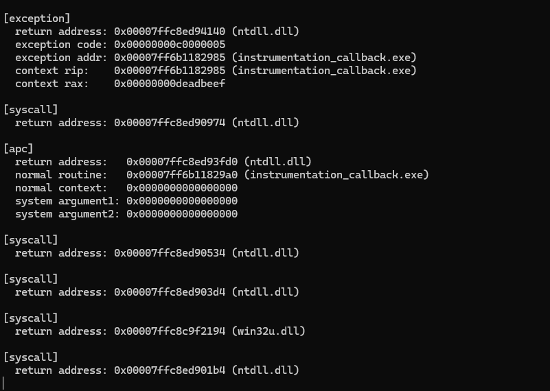

# windows_instrumentation_callback

A Proof-of-Concept implementing the undocumented **Process Instrumentation Callback** mechanism in Windows x64. This technique allows for the interception of kernel-to-user mode transitions, effectively acting as a global hook for system calls, APCs, and exceptions within the process.

## Technical Background

The Instrumentation Callback is a feature historically designed for performance profiling, but it has been widely adopted by modern Anti-Cheat solutions (e.g., Hyperion/Byfron) and EDR systems to validate execution integrity.

### Kernel Mechanism (EPROCESS)
Internally, the Windows kernel maintains a specific field within the `EPROCESS` structure-specifically inside the `KPROCESS` substructure.

1.  **Registration:** The user-mode process invokes `NtSetInformationProcess` with the `ProcessInstrumentationCallback` (class 40) information class, passing the address of an assembly thunk.
2.  **Storage:** The kernel stores this callback address in the `InstrumentationCallback` field of the current process's `KPROCESS` structure.
3.  **Transition:** Whenever the kernel prepares to return execution to user mode (via `sysret`, `iret`, or `sysexit`):
    *   It checks if the `InstrumentationCallback` field is non-null.
    *   If set, the kernel swaps the target user-mode `RIP` (the original return address) with the registered callback address.
    *   The original return address is placed into the `R10` register.
    *   The `RAX` register holds the return value of the system call.

### Execution Flow
Because the CPU context is swapped at the very edge of the kernel boundary, the callback executes immediately upon re-entering Ring 3. This requires the callback to be implemented in pure Assembly to:
1.  Preserve the volatile register state (including XMM/YMM registers) to avoid corrupting the program flow.
2.  Align the stack properly.
3.  Forward execution to a high-level handler.
4.  Restore the state and jump to `R10` to resume normal execution.

**Recursion Prevention**: Logging is performed via direct `NtWriteFile` calls to avoid triggering recursive callbacks that standard I/O libraries (like `printf`) would cause.

Showcase:
